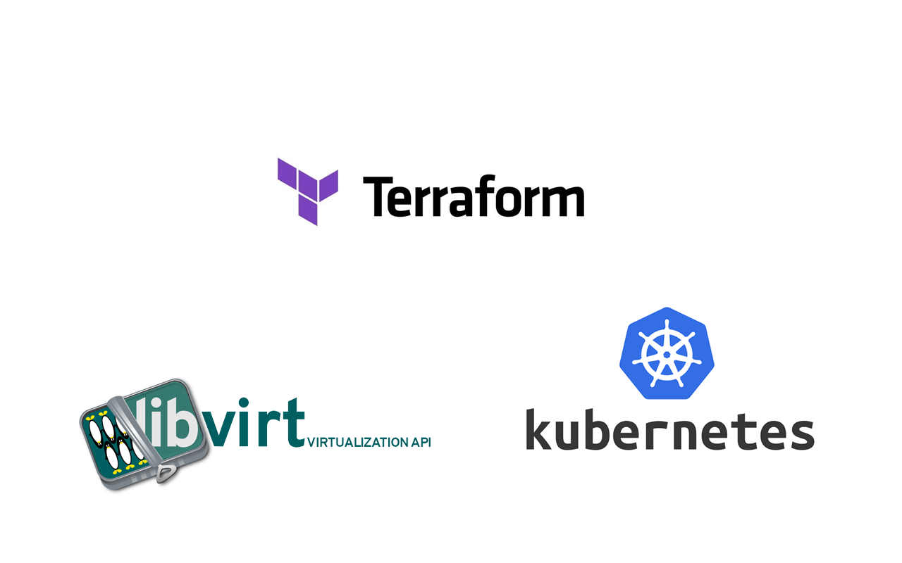

# terraform-libvirt-k8s-infrastructure

<p align="center">
    
</p>

This Terraform module will provision the libvirt infrastructure for a kubernetes cluster (pool, volumes & domains)

# Example

The following example is a basic example which requires no more than the password for the nodes, the password is SHA512 hashed and stored in the cloud-init script

```yaml
resource "libvirt_pool" "volumes" {
  name = "volumes"
  type = "dir"
  # apparmour either needs to be disabled or setup to read/write to this dir
  path = "/var/lib/libvirt/images/volumes"
}

module "cluster_infrastructure" {
  source = "github.com/sculley/terraform-libvirt-k8s-infrastructure"

  # a hashed p/w is generated from this sensitive value
  node_pw = "password"
  pool = libvirt_pool.volumes.name
}
```

A more advanced example is below, in this example we provide a custom cloud-init file and specify some settings for the controlplane nodes and node_groups such as the number of controlplane nodes and nodes in the node_group. We also update the memory set.

```yaml
data "template_file" "user_data" {
  template = templatefile("${path.module}/templates/cloudinit/cloud_init.cfg.tpl", {
    cloud_user_public_key = var.cloud_user_public_key
  })
}

# generate the network_config file to build into the ubuntu image
data "template_file" "network_config" {
  template = templatefile("${path.module}/templates/cloudinit/network_config.cfg.tpl", {})
}

resource "libvirt_pool" "volumes" {
  name = "volumes"
  type = "dir"
  # apparmour either needs to be disabled or setup to read/write to this dir
  path = "/var/lib/libvirt/images/volumes"
}

module "cluster_infrastructure" {
  source = "github.com/sculley/terraform-libvirt-k8s-infrastructure"

  cloud_init_user_data      = data.template_file.user_data.rendered
  cloud_init_network_config = data.template_file.network_config.rendered
  pool = libvirt_pool.volumes.name

  controlplane_node_group = {
    count  = 1
    memory = "2568"
  }
  
  node_group = {
    count  = 1
  }
}
```

## Requirements

| Name | Version |
|------|---------|
| <a name="requirement_terraform"></a> [terraform](#requirement\_terraform) | >= 1.0.0 |
| <a name="requirement_libvirt"></a> [libvirt](#requirement\_libvirt) | 0.6.14 |

## Providers

| Name | Version |
|------|---------|
| <a name="provider_template"></a> [template](#provider\_template) | n/a |

## Modules

| Name | Source | Version |
|------|--------|---------|
| <a name="module_controlplane_nodes"></a> [controlplane\_nodes](#module\_controlplane\_nodes) | ./modules/controlplanes | n/a |
| <a name="module_nodes"></a> [nodes](#module\_nodes) | ./modules/nodes | n/a |

## Resources

| Name | Type |
|------|------|
| [template_file.network_config](https://registry.terraform.io/providers/hashicorp/template/latest/docs/data-sources/file) | data source |
| [template_file.user_data](https://registry.terraform.io/providers/hashicorp/template/latest/docs/data-sources/file) | data source |

## Inputs

| Name | Description | Type | Default | Required |
|------|-------------|------|---------|:--------:|
| <a name="input_cloud_init_network_config"></a> [cloud\_init\_network\_config](#input\_cloud\_init\_network\_config) | The cloud-init network config used to build the common cloud-init image when creating nodes | `string` | `"null"` | no |
| <a name="input_cloud_init_user_data"></a> [cloud\_init\_user\_data](#input\_cloud\_init\_user\_data) | The cloud-init config used to build the common cloud-init image when creating nodes | `string` | `null` | no |
| <a name="input_controlplane_node_group_defaults"></a> [controlplane\_node\_group\_defaults](#input\_controlplane\_node\_group\_defaults) | The default controlplane settings applied to the hosts if none are provided in the controlplane\_settings parameter | `any` | <pre>{<br>  "count": 2,<br>  "create": true,<br>  "memory": "2048",<br>  "os_source": "https://cloud-images.ubuntu.com/releases/focal/release/ubuntu-20.04-server-cloudimg-amd64.img",<br>  "vcpu": "1"<br>}</pre> | no |
| <a name="input_controlplane_settings"></a> [controlplane\_settings](#input\_controlplane\_settings) | The controlplane settings applied to the hosts | `any` | `{}` | no |
| <a name="input_node_group_defaults"></a> [node\_group\_defaults](#input\_node\_group\_defaults) | The default node\_group settings applied to the hosts if none are provided in the node\_group\_settings parameter | `any` | <pre>{<br>  "count": 3,<br>  "create": false,<br>  "memory": "4096",<br>  "os_source": "https://cloud-images.ubuntu.com/releases/focal/release/ubuntu-20.04-server-cloudimg-amd64.img",<br>  "vcpu": "1"<br>}</pre> | no |
| <a name="input_node_group_settings"></a> [node\_group\_settings](#input\_node\_group\_settings) | The node\_group settings applied to the hosts | `any` | `{}` | no |
| <a name="input_node_passwd"></a> [node\_passwd](#input\_node\_passwd) | The cloud-user password added to the controlplane and nodes\_groups | `string` | `""` | no |
| <a name="input_node_public_key"></a> [node\_public\_key](#input\_node\_public\_key) | The cloud-user public key used for authentication added to the controlplane and nodes\_groups | `string` | `""` | no |
| <a name="input_pool"></a> [pool](#input\_pool) | The libvirt pool to store node disks/volumes | `string` | n/a | yes |

## Outputs

| Name | Description |
|------|-------------|
| <a name="output_controlplane_node_ips"></a> [controlplane\_node\_ips](#output\_controlplane\_node\_ips) | List of IP's for the controlplane nodes |
| <a name="output_node_ips"></a> [node\_ips](#output\_node\_ips) | List of IP's for the nodes |